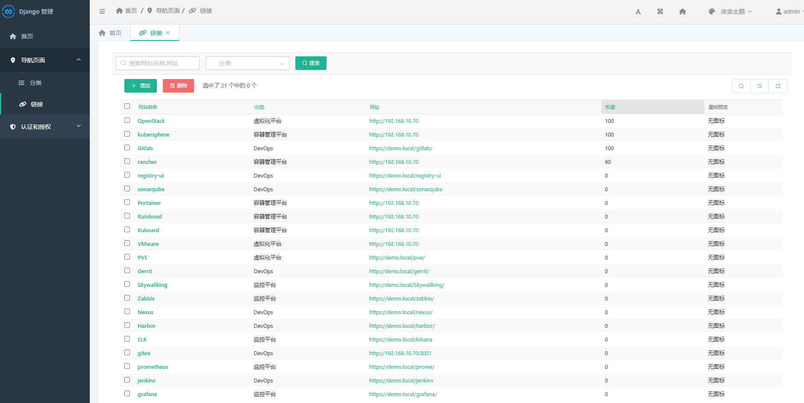

## 使用Django创建简单网址导航管理页面

*首页样例*
 
*后台样例*


## 部署启动
### 安装依赖
```shell
python3 install -r requirements.txt
```
### 数据库默认为sqlite，
```python
DATABASES = {
    'default': {
        'ENGINE': 'django.db.backends.sqlite3',
        'NAME': BASE_DIR / 'db.sqlite3',
    }
}
```
### 其他数据库修改settings.py 然后迁移数据
```python
# mysql 数据库样例
import pymysql
pymysql.install_as_MySQLdb()

DATABASES = {
    'default': {
        'ENGINE': 'django.db.backends.mysql',
        'NAME': 'navigation',
        'HOST': '192.168.1.1',
        'USER': 'root',
        'PASSWORD': 'pwd',
        'PORT': '3306',
    }
}
```
```shell
python manage.py makemigrations
python manage.py migrate
```

### 启动
```shell
# 开发环境启动
python3 manage.py runserver

# uwsgi启动
uwsgi --ini navigation_page/uwsgi.ini
```

### 容器部署
```shell
# 构建镜像
docker build -t navigation_page:latest .

# compose启动
docker-compose up -d
```
### 访问
访问 http://IP:端口
默认密码 admin/admin

后台添加网址或者上传图标

